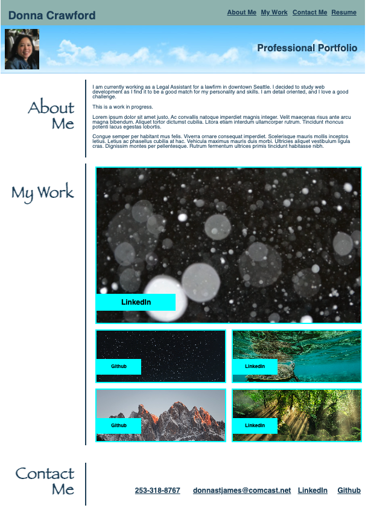

# Homework02

## Description

I created a personal portfolio using HTML and a CSS style sheet.  The HTML contains semantic tags, and href tags contain appropriate alt attributes, making it more accessible.  The Flexbox rule was applied to the project section of the page, and the website is responsive to various device widths.

